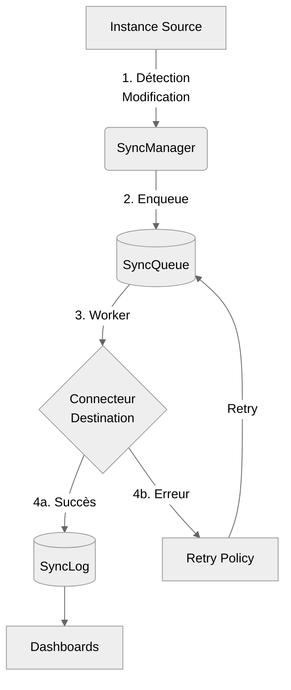
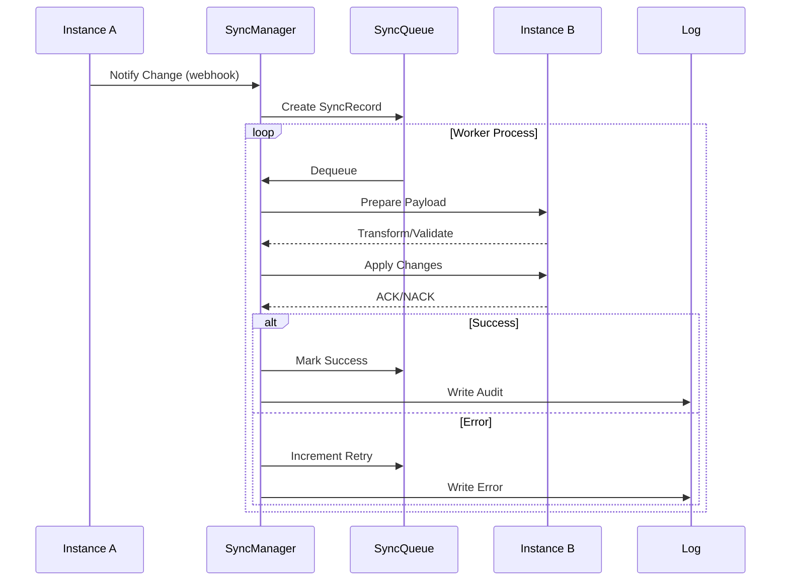
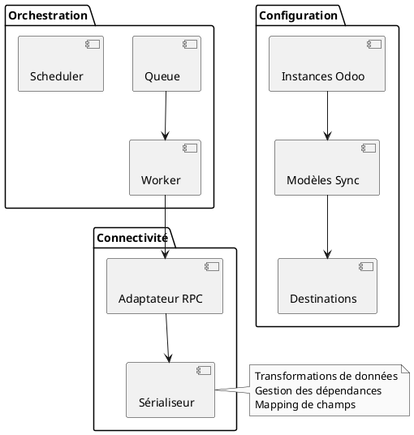

# Module de Synchronisation Odoo-to-Odoo

## Objectif
Ce module permet la synchronisation bidirectionnelle de données entre deux instances Odoo via XML-RPC, avec un système de validation et de reprise robuste.

## Architecture

### Flux Global


### Séquence de Synchronisation


## Caractéristiques Principales

### 1. Architecture Multi-Instances et Asynchrone
- Support de connexions multiples vers différentes instances Odoo
- Insertion automatique dans la queue via surcharge des méthodes create/write/unlink
- Traitement en arrière-plan des synchronisations via un worker dédié
- Possibilité de synchronisation immédiate pour les cas critiques

### 2. Configuration 
- Mapping des champs configurable par modèle, par relation odoo-odoo
- Gestion automatique des dépendances entre modèles
- Paramètres de connexion sécurisés pour chaque instance

### 3. Mécanismes de Validation
- Validation des données avant synchronisation
- Vérification de l'intégrité des données
- Gestion des conflits de synchronisation
- Journalisation détaillée des opérations

### 4. Système de Reprise
- Détection automatique des échecs
- File d'attente des tentatives échouées
- Stratégie de réessai configurable
- Notification des erreurs critiques

### 5. Monitoring
- Interface de suivi des synchronisations
- Statistiques de performance
- Journal des erreurs
- Alertes configurables

## Flux de Synchronisation

1. **Détection des Changements**
   - Surveillance des modifications sur les modèles configurés
   - Création d'une entrée dans la file de synchronisation

2. **Validation Initiale**
   - Vérification des données à synchroniser
   - Validation des dépendances

3. **Synchronisation**
   - Envoi des données via XML-RPC
   - Gestion des réponses et erreurs

4. **Validation Finale**
   - Vérification de la synchronisation
   - Confirmation de l'intégrité

5. **Journalisation**
   - Enregistrement du résultat
   - Mise à jour des statistiques

## Architecture Technique



### Configuration et Observers

#### Instances Odoo (odoo.sync.instance)
Configuration des connexions aux instances distantes :
- `name` : Nom de l'instance
- `url` : URL de l'instance
- `database` : Base de données
- `username` : Utilisateur technique
- `password` : Mot de passe (chiffré)
- `active` : Instance active/inactive
- `state` : État de la connexion

#### Modèles Synchronisés (odoo.sync.model)
Configuration des modèles à synchroniser :
- `model_id` : Référence vers ir.model
- `name` : Nom du modèle (computed)
- `odoo_id` : Mapping avec odoo.sync.instance
- `active` : Synchronisation active/inactive
- `priority` : Ordre de synchronisation pour les dépendances

#### Champs Synchronisés (odoo.sync.model.field)
Configuration des champs par modèle :
- `field_id` : Référence vers ir.model.fields
- `name` : Nom technique du champ (computed)
- `required` : Champ obligatoire pour la synchronisation
- `sync_default` : Valeur par défaut si non disponible
- Exclusion des champs calculés (sauf si modifiables manuellement)

#### Destinations (odoo.sync.model.destination)
Configuration des destinations par modèle :
- `model_sync_id` : Référence vers odoo.sync.model
- `instance_id` : Référence vers odoo.sync.instance
- `target_model` : Modèle cible sur l'instance distante
- `active` : Synchronisation active pour cette destination
- `field_ids` : Champs à synchroniser pour cette destination

#### Gestionnaire de Synchronisation (odoo.sync.manager)
```python
class OdooSyncManager(models.Model):
    _name = 'odoo.sync.manager'
    _description = 'Gestionnaire de synchronisation Odoo'

    @api.model
    def _get_sync_models(self):
        """Récupère tous les modèles actifs à synchroniser"""
        return self.env['odoo.sync.model'].search([('active', '=', True)])

    @api.model
    def _queue_sync(self, record, operation, changed_fields=None):
        """Ajoute une opération dans la queue de synchronisation"""
        sync_model = self.env['odoo.sync.model'].search([
            ('model_id.model', '=', record._name),
            ('active', '=', True)
        ])
        if not sync_model:
            return

        # Pour chaque destination configurée
        for destination in sync_model.destination_ids.filtered('active'):
            # Récupérer les champs configurés pour cette destination
            sync_fields = destination.field_ids

            # En cas de mise à jour, vérifier si les champs modifiés sont à synchroniser
            if operation == 'write' and changed_fields:
                relevant_fields = set(changed_fields) & set(sync_fields.mapped('name'))
                if not relevant_fields:
                    continue  # Aucun champ modifié n'est à synchroniser

            # Préparer les données à synchroniser
            sync_data = {}
            for field in sync_fields:
                if field.mapping_type == 'direct':
                    sync_data[field.name] = record[field.name]
                elif field.mapping_type == 'function' and field.mapping_function:
                    # Appel de la fonction de transformation
                    sync_data[field.name] = getattr(record, field.mapping_function)()
                elif field.mapping_type == 'computed':
                    # Gestion spéciale pour les champs computed si nécessaire
                    sync_data[field.name] = record[field.name]

            # Créer l'entrée dans la queue
            self.env['odoo.sync.queue'].create({
                'model_id': sync_model.model_id.id,
                'resource_id': record.id,
                'other_odoo_id': destination.instance_id.id,
                'other_odoo_resource_id': record.get_external_id().get(record.id),  # Si déjà synchronisé
                'type': operation,
                'state': 'pending',
                'data_json': json.dumps(sync_data),
                'create_date': record.create_date,
                'write_date': record.write_date
            })

    @api.model
    def _observe_changes(self, method):
        """Décorateur pour observer les changements sur les modèles configurés"""
        def wrapper(self, *args, **kwargs):
            # Capturer les champs modifiés pour write
            changed_fields = list(kwargs.get('vals', {}).keys()) if method.__name__ == 'write' else None
            
            result = method(self, *args, **kwargs)
            sync_manager = self.env['odoo.sync.manager']
            
            if isinstance(result, models.Model):
                for record in result:
                    sync_manager._queue_sync(record, method.__name__, changed_fields)
            
            return result
        return wrapper

# Application des observers sur les méthodes standard
models.Model.create = OdooSyncManager._observe_changes(models.Model.create)
models.Model.write = OdooSyncManager._observe_changes(models.Model.write)
models.Model.unlink = OdooSyncManager._observe_changes(models.Model.unlink)

### Template de Code pour le Gestionnaire

```python
class OdooSyncManager(models.Model):
    _name = 'odoo.sync.manager'
    
    def _process_sync_queue(self):
        """Template de traitement de la queue"""
        jobs = self.env['odoo.sync.job'].search([('state', '=', 'pending')])
        for job in jobs:
            try:
                # Logique de synchronisation
                self._execute_sync(job)
                job.write({'state': 'done'})
            except Exception as e:
                job.write({
                    'state': 'failed',
                    'error_message': str(e),
                    'retry_count': job.retry_count + 1
                })

    def _execute_sync(self, job):
        """Template d'exécution d'une synchronisation"""
        adapter = self._get_rpc_adapter(job.instance_id)
        serializer = self._get_serializer(job.model_id)
        
        data = serializer.serialize(job.record_id)
        response = adapter.execute(job.operation, data)
        
        if not response['success']:
            raise SyncException(response['error_code'])
```

## Modèles de Données

### SyncConfiguration
#### Configuration des Instances (odoo.sync.instance)
- Nom de l'instance
- URL de l'instance
- Base de données
- Identifiants de connexion sécurisés
- État de la connexion

#### Configuration des Modèles (odoo.sync.model)
- Modèle Odoo à synchroniser
- Liste des instances Odoo cibles
- Mapping des champs
- Direction de la synchronisation (uni/bidirectionnelle)
- Champs à surveiller
- Règles de synchronisation spécifiques

### SyncQueue
Table principale pour la gestion des synchronisations :
- `model_id` : Modèle Odoo à synchroniser
- `resource_id` : ID de la ressource locale
- `other_odoo_id` : ID de l'instance Odoo distante
- `other_odoo_resource_id` : ID de la ressource sur l'instance distante
- `type` : Type d'opération (create, update, unlink)
- `state` : État de la synchronisation
- `retry_count` : Nombre de tentatives
- `last_error` : Dernière erreur rencontrée
- `data_json` : Données à synchroniser au format JSON
- `create_date` : Date de création dans la queue
- `write_date` : Date de dernière modification
- `other_create_date` : Date de création sur l'instance distante
- `other_write_date` : Date de dernière modification sur l'instance distante

### SyncLog
- Journal détaillé des opérations
- Erreurs et avertissements
- Statistiques de performance

### Gestion des Conflits

#### Détection
- Comparaison des horodatages `write_date` (source) vs `other_write_date` (cible)
- Seuil de tolérance configurable (défaut : 5 minutes)

#### Stratégies de Résolution
1. **Priorité source** : Écrasement de la version cible
2. **Priorité destination** : Conservation de la version cible  
3. **Fusion manuelle** :
   - Notification aux administrateurs
   - Interface de comparaison côte-à-côte
   - Historique des versions (diff)

#### Cas Particuliers
- Réconciliation des relations Many2many/One2many
- Gestion des suppressions/archivages croisés

### Journalisation Avancée (SyncLog)

#### Niveaux de Log
- **DEBUG**: Payloads complets et traces d'exécution
- **INFO**: Diffs des modifications et métadonnées
- **WARNING**: Erreurs non critiques (ex: timeouts)
- **ERROR**: Échecs critiques de synchronisation

#### Politique de Rétention
- Stockage local: 90 jours (accès rapide)
- Archivage long terme: AWS S3 Glacier (7 ans)
- Format d'archivage: Parquet compressé

#### Masquage des Données Sensibles
Fonction de masquage automatique :
```python
def sanitize_log_entry(entry):
    sensitive_fields = ['password', 'api_key', 'token']
    for field in sensitive_fields:
        if field in entry['data']:
            entry['data'][field] = '*****'
    return entry
```

### Sécurité des Données

#### Chiffrement
- TLS 1.3 obligatoire pour les communications
- Rotation automatique des certificats (Let's Encrypt)
- Chiffrement AES-256 au repos pour :
  - SyncQueue.data_json
  - SyncLog.payload

#### Gestion des Accès
- Authentification mutuelle OAuth2 avec JWT :
  ```python
  # Génération de token sécurisé
  def generate_jwt(secret, payload):
      return jwt.encode(payload, secret, algorithm="HS256")
  ```
- RBAC (Role-Based Access Control) :
  - Rôle 'Sync Admin' : Configuration complète
  - Rôle 'Sync Auditor' : Lecture seule

#### Audit
- Logs d'accès horodatés avec IP/user-agent
- Intégration SIEM (ex: Splunk, ELK)

## Sécurité
- Authentification sécurisée entre instances
- Encryption des données sensibles
- Validation des permissions
- Audit des opérations

## Interface Utilisateur
- Configuration des synchronisations
- Monitoring en temps réel
- Gestion des erreurs
- Rapports et statistiques

## Performance
- Optimisation des requêtes
- Gestion de la charge
- Limitation des appels API
- Mise en cache intelligente

## Performance à l'Échelle

#### Architecture Scalable
- File d'attente Redis pour découplage
- Scaling horizontal via Kubernetes
- Partitionnement par modèle/instance

#### Optimisations
- Cache des relations fréquemment accédées
- Compression LZ4 des payloads volumineux
- Traitement batch avec isolation transactionnelle

#### Monitoring
- Dashboard Grafana avec :
  - Débit (records/min)
  - Latence (P50/P90/P99)
  - Taux d'utilisation des workers

## Maintenance
- Outils de diagnostic
- Nettoyage automatique des logs
- Gestion des sauvegardes
- Procédures de mise à jour

## Gestion des Conflits de Synchronisation

### Détection des Conflits
- **Conflit de Version** : Détecté lorsque la version locale et distante ont été modifiées depuis la dernière synchronisation
- **Conflit de Données** : Détecté lorsque les mêmes champs ont été modifiés différemment sur les deux instances
- **Conflit de Relations** : Détecté lorsque des enregistrements liés sont incohérents entre les instances

### Stratégies de Résolution
1. **Automatique**
   - Priorité configurable par instance (master/slave)
   - Règles de fusion personnalisables par champ
   - Horodatage "le plus récent gagne"

2. **Manuelle**
   - Interface de résolution pour l'utilisateur
   - Visualisation côte à côte des différences
   - Options : garder source, garder destination, fusionner, ignorer

### Configuration des Règles de Résolution
```python
class OdooSyncModelField(models.Model):
    _inherit = 'odoo.sync.model.field'

    conflict_strategy = fields.Selection([
        ('source_wins', 'Source gagne'),
        ('dest_wins', 'Destination gagne'),
        ('newest', 'Plus récent'),
        ('manual', 'Résolution manuelle')
    ], default='newest')
```

## Gestion des Suppressions

### Stratégies de Suppression
1. **Suppression Douce**
   - Marquage comme inactif sur les deux instances
   - Conservation de l'historique
   - Possibilité de restauration

2. **Suppression Dure**
   - Suppression physique sur les deux instances
   - Vérification des dépendances
   - Journal d'audit détaillé

### Configuration
```python
class OdooSyncModel(models.Model):
    _inherit = 'odoo.sync.model'

    deletion_strategy = fields.Selection([
        ('soft', 'Suppression douce'),
        ('hard', 'Suppression physique'),
        ('ignore', 'Ignorer'),
        ('manual', 'Validation manuelle')
    ], default='soft')

    cascade_deletion = fields.Boolean('Cascade aux enregistrements liés')
```

## Sécurité et Droits d'Accès

### Niveaux de Sécurité
1. **Niveau Instance**
   - Authentification par token JWT
   - Chiffrement des communications
   - Restriction par IP

2. **Niveau Utilisateur**
   - Groupes de sécurité dédiés
   - Journalisation des actions
   - Validation multi-niveau

### Groupes de Sécurité
```xml
<record id="group_sync_user" model="res.groups">
    <field name="name">Synchronisation : Utilisateur</field>
    <field name="category_id" ref="base.module_category_usability"/>
</record>

<record id="group_sync_manager" model="res.groups">
    <field name="name">Synchronisation : Manager</field>
    <field name="implied_ids" eval="[(4, ref('group_sync_user'))]"/>
</record>
```

### Règles de Sécurité
```xml
<record id="rule_sync_model_manager" model="ir.rule">
    <field name="name">Sync Manager : Accès Total</field>
    <field name="model_id" ref="model_odoo_sync_model"/>
    <field name="groups" eval="[(4, ref('group_sync_manager'))]"/>
    <field name="domain_force">[(1, '=', 1)]</field>
</record>
```

## Exemples de Configuration

### 1. Synchronisation des Produits
```python
# Configuration du modèle
product_sync = {
    'model': 'product.template',
    'fields': {
        'name': {'type': 'direct'},
        'list_price': {'type': 'direct'},
        'standard_price': {
            'type': 'function',
            'mapping': 'map_cost_price'
        },
        'categ_id': {
            'type': 'relation',
            'model': 'product.category',
            'match_field': 'name'
        }
    },
    'conflict_strategy': 'newest'
}

# Fonction de mapping personnalisée
def map_cost_price(self, record):
    return record.standard_price * self.currency_rate
```

### 2. Synchronisation des Commandes
```python
# Configuration du modèle
sale_sync = {
    'model': 'sale.order',
    'fields': {
        'name': {'type': 'direct'},
        'partner_id': {
            'type': 'relation',
            'model': 'res.partner',
            'match_field': 'ref'
        },
        'order_line': {
            'type': 'one2many',
            'fields': ['product_id', 'quantity', 'price_unit']
        }
    },
    'deletion_strategy': 'soft',
    'conflict_strategy': 'manual'
}
```

### 3. Interface de Configuration
```xml
<record id="view_sync_config_form" model="ir.ui.view">
    <field name="name">odoo.sync.config.form</field>
    <field name="model">odoo.sync.model</field>
    <field name="arch" type="xml">
        <form>
            <group>
                <field name="model_id"/>
                <field name="active"/>
                <field name="deletion_strategy"/>
            </group>
            <notebook>
                <page string="Champs">
                    <field name="field_ids">
                        <tree editable="bottom">
                            <field name="field_id"/>
                            <field name="sync_type"/>
                            <field name="conflict_strategy"/>
                        </tree>
                    </field>
                </page>
            </notebook>
        </form>
    </field>
</record>
```

## Scénarios de Test Critiques

### TC-01 : Synchronisation bidirectionnelle
**Préconditions**:
- 2 instances interconnectées
- Modèle 'res.partner' configuré

**Étapes**:
1. Créer partenaire sur Instance A
2. Vérifier création sur Instance B
3. Modifier partenaire sur Instance B
4. Vérifier mise à jour sur Instance A

**Résultat attendu**:
- SyncLog avec code SYNC_200 sur les deux instances
- Données cohérentes après boucle complète

### TC-02 : Gestion des conflits
**Préconditions**:
- Même enregistrement modifié simultanément sur les deux instances

**Étapes**:
1. Modifier le champ 'name' sur Instance A
2. Modifier le champ 'email' sur Instance B
3. Déclencher manuellement la synchronisation

**Résultat attendu**:
- Application de la stratégie de résolution configurée
- Journalisation du conflit (SYNC_409)

### TC-03 : Tolérance aux pannes
**Préconditions**:
- Instance B hors ligne

**Étapes**:
1. Tenter une synchronisation
2. Redémarrer Instance B
3. Relancer la synchronisation

**Résultat attendu**:
- Rejeu automatique des transactions en erreur
- Conservation des données en queue pendant 24h

## Procédures de Déploiement

### Prérequis
- Odoo 15.0+
- Accès API aux instances distantes
- Bibliothèque python-requests

### Installation
1. Copier le répertoire `odoo_to_odoo_sync` dans `addons/`
2. Redémarrer le serveur Odoo
3. Installer le module via l'interface d'administration

### Configuration
```python
# Configuration de base dans odoo.conf
[odoo_sync]
max_retries = 3
retry_delay = 300  # secondes
queue_size = 1000

# Activation du mode debug
debug = False
```

### Tests
```bash
# Lancer les tests d'intégration
$ ./odoo-bin -i odoo_to_odoo_sync --test-enable